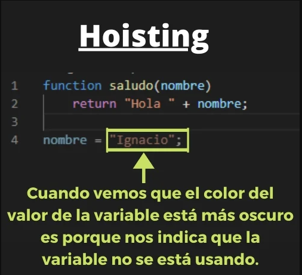
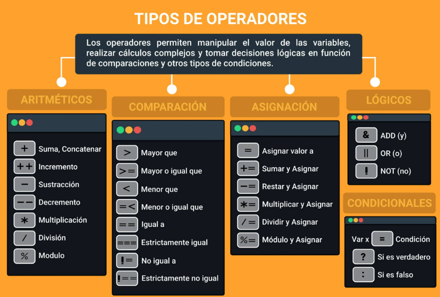
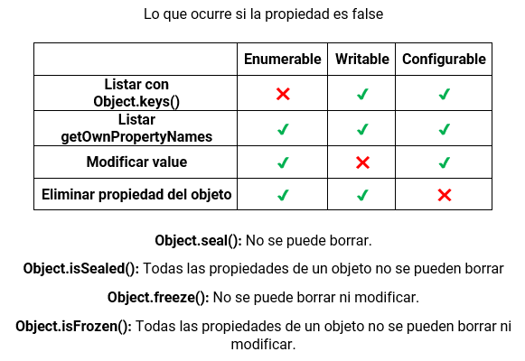
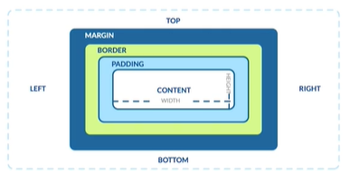
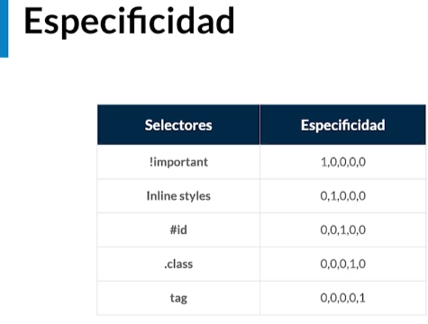
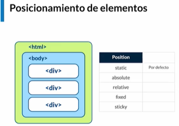

# Entorno de Desarrollo en Windows

## DevTools para desarrolladores

- [DevTools Develoments](https://chrome.google.com/webstore/category/ext/11-web-development)
- [LightHouse](https://chrome.google.com/webstore/detail/lighthouse/blipmdconlkpinefehnmjammfjpmpbjk?hl=es)

## Hoisting



## Coerción de tipos


## Operadores de igualdad

1. Existen dos tipos de igualdad:

- Igualdad de valor (==): Por ejemplo: "3"==3 son iguales.
- Igualdad de valor y tipo de dato (===): En el ejemplo anterior ya no serían iguales.



## Listas Y Objetos

- Array: Es una lista de elementos, PUEDEN SER DE CUALQUIER TIPO.
- Objeto: Es una lista de elementos PERO cada elemento tiene un nombre clave.

### ¿Cuándo es mejor usar objetos o arrays?

Arrays cuando lo que haremos en un elemento es lo mismo que en todos los demás (la regla se puede incumplir). Mientras que un objeto cuando los nombres de cada elemento son importantes para nuestro algoritmo.

# Closures y Scope (Alcance) en Javascript


## Reasignación y declaración de variables


# Static: atributos y métodos estáticos en JavaScript

1. Si declaramos una propiedad o método de una clase como static, podremos acceder a estos sin la necesidad de instanciar dicha clase o prototipo.

De esta manera podemos declarar atributos o métodos como static en una clase (aplicable también a prototipos):

```js
class Patito {
  static sonidito = "cuak!";

  static hacerSonidito() {
    return "cuak! x2";
  }
}

// Por fuera de clase Patito, podemos acceder a lo siguiente sin crear alguna instancia:
// Al atributo `sonidito`
console.log(Patito.sonidito);

// Al método `hacerSonidito`
console.log(Patito.hacerSonidito());
```

## Obtener las llaves de un objeto

1. El método keys del superprototipo Object nos permite obtener el nombre de las llaves de un objeto en una lista:

```js
const objetito = {
  name: "Juanito",
  email: "juanito@frijolitos.io",
  age: 18,
};

console.log(Object.keys(objetito)); // [ 'name', 'email', 'age' ]
```

- Podríamos obtener lo mismo con el método getOwnPropertyNames:

```js
const objetito = {
  name: "Juanito",
  email: "juanito@frijolitos.io",
  age: 18,
};

console.log(Object.getOwnPropertyNames(objetito)); // [ 'name', 'email', 'age' ]
```

## Obtener los pares llave-valor de un objeto

1. Con el método entries de Object conseguimos tener en listas separadas los llave-valor declarados en un objeto. Estas listas serán almacenadas en otra lista:

```js
const objetito = {
  name: "Juanito",
  email: "juanito@frijolitos.io",
  age: 18,
};

console.log(Object.entries(objetito));

/* > Impresión en consola:
[
  [ 'name', 'Juanito' ],
  [ 'email', 'juanito@frijolitos.io' ],
  [ 'age', 18 ]
]
*/
```

## Conocer el límite de acceso de un objeto

1. Existe un método static propio de Object que es muy interesante: el método getOwnPropertyDescriptors.

```js
const objetito = {
  name: "Juanito",
  email: "juanito@frijolitos.io",
  age: 18,
};

console.log(Object.getOwnPropertyDescriptors(objetito));
```

- Obtendremos un objeto con los atributos del inicial. Cada atributo contiene un objeto con el valor correspondiente, además de 3 propiedades adicionales: writable, configurable y enumerable.

```js
{
  name: {
    value: 'Juanito',
    writable: true,
    enumerable: true,
    configurable: true
  },
  email: {
    value: 'juanito@frijolitos.io',
    writable: true,
    enumerable: true,
    configurable: true
  },
  age: {
		value: 18,
		writable: true,
		enumerable: true,
		configurable: true
	}
}
```

- Estas 3 propiedades son usadas por JavaScript internamente para indicar el límite de acceso y modificación. Podríamos utilizar ciertas técnicas para manejar el encapsulamiento (Privecidad POO) de los objetos.

## Object property descriptors



# FRONTEND

## Tipos de imagenes


# Modelo de caja



# Especifidad



# Posicionamiento



# Teoria del color


# NPM

```sh
# Tomara el paquete como dependencia de producción
npm install name_package

# Tomara el paquete como dependencia de desarrollo
npm install name_package --save-dev # O -D

# Tomara el paquete como dependencia global
npm install name_package -g

# Tomara el paquete como dependencia de producción y lo agregara al package.json
npm install name_package --save # O -S

# Tomara el paquete como dependencia opcional
npm install name_package -o # O --optional

npm list # Lista los paquetes instalados, si se agrega -g lista los paquetes globales

npm install name_package@version # Instala una version especifica del paquete, si no se especifica la version instala la ultima

# npx ejecuta el paquete sin instalarlo
npx name_package

npm outdate # Muestra los paquetes que se pueden actualizar

# Desinstala el paquete
npm uninstall name_package
```
